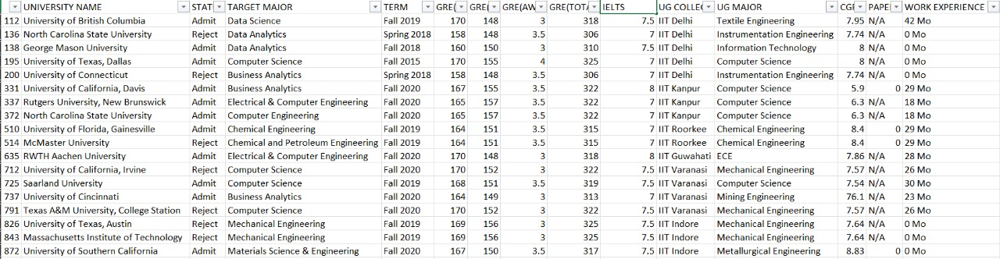
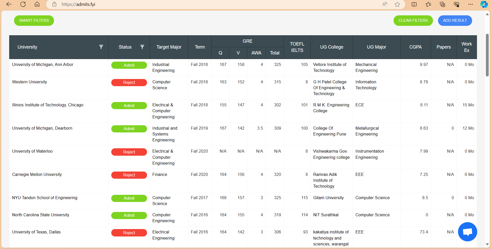
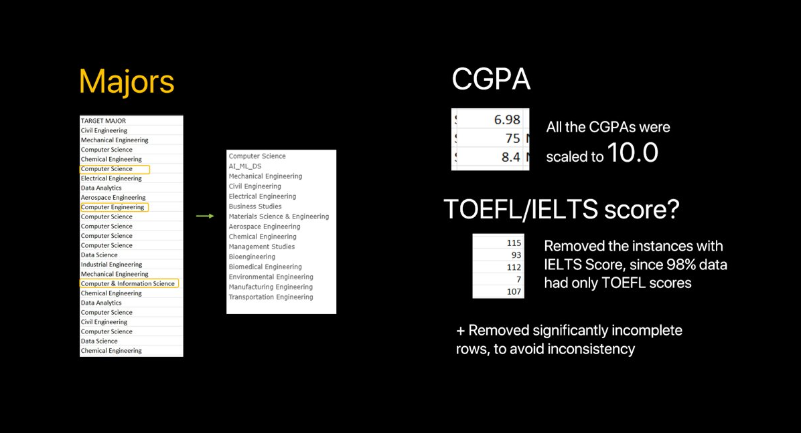
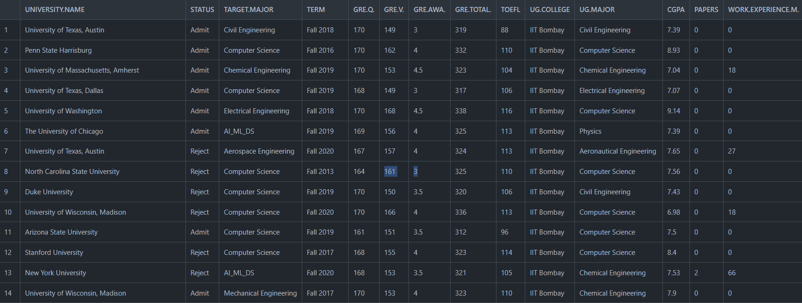

```{r setup, include=FALSE}
library(htmlwidgets)
library(IRdisplay)
library(ggplot2)
library(plotly)
knitr::opts_chunk$set(echo = FALSE, warning = FALSE, message = FALSE)
```

## Executive Summary

This report presents a comprehensive analysis of trends and patterns in students' applications for postgraduate programs.
We looked closely at a number of the variables affecting the application process using R Studio.
The results offer significant perspectives for educational establishments seeking to improve their postgraduate admissions tactics.

## Table of Contents

### 1. Introduction

1.1 Overview

1.2 Questions we imposed

1.3 Scope of Analysis

### 2. Explaining the Dataset

2.1 Overview of Dataset

2.2 Problems with the dataset


### 3. Data Scraping and Methodology

3.1 Data Sources

3.2 Variables Considered

3.3 Data Preprocessing


### 4. Trends in Postgraduate Program Applications(Visualizing the dataset)

4.1 Libraries used in the process

4.2 Plots we have used

4.3 Plot of Average CGPA by University

4.4 Plot of Status Distribution for University of Washington

4.5 Plot of students changing their UG Major

4.6 Plot on Comaparasion between who have and have not changed their UG major

4.7 Plot of CGPA v/s TOEFL of IIT Kanpur

4.8 Plot on Admit v/s Reject based on UG Major of IIT Bombay

4.9 Admissions Pie Chart for University of Texas,Austin

4.10 Plot on TARGET.MAJOR v/s CGPA

### 5. Conclusion

### 6. References

## 1.Introduction

### 1.1 Overview

The increasing competitiveness of postgraduate programs has made the process of choosing a good program at a reputable university difficult and requires a thorough understanding of application trends and patterns.
This analysis aims to provide an insight on academic institutions to help applicants in their admission processes.

### 1.2 Questions We imposed

-   What Majors are students preferring?
-   How many students prefer changing their majors from UnderGrad to PostGrad?
-   Which Universities are preferred for a particular major?
-   What are the *Admit/Reject* chances?
-   Does **CGPA** really matters?
-   How much does the factors like writing papers and and having work experience affect the Admit chances?
 

### 1.3 Scope of Analysis

The study covers data of 100 students from IIT Bombay, IIT Delhi, IIT Madras, IIT Kanpur, IIT Kharagpur, IIT Roorkee, IIT Guwahati with different Degrees applying for Post-Graduation in different foreign Universities and then based on their *CPI/CGPA*, *UG College* and *Degree*, *GRE* and *TOEFL/IELTS* scores and work experience whether their application got accepted or rejected.


### 2. Explaing the dataset

#### 2.1 Overview of the dataset

Our project consists of the data of various students from different Colleges and Degrees applying for Post-Graduation in Foreign Universities and then based on their *CPI/CGPA*, *UG College* and *Degree, GRE* and *TOEFL* scores and work experience whether their application got accepted or rejected.As of now, we have scraped data of these colleges : IIT Bombay, IIT Delhi, IIT Madras, IIT Kanpur, IIT Kharagpur, IIT Roorkee, IIT Guwahati For each college, we have scraped data of 100 students.

#### 2.2 Problems with the dataset

The analysis of the scraped dataset revealed notable challenges, primarily centered around data completeness and potential sample bias.
A significant concern emerged from the observation that a mere 2% of applicants had provided IELTS scores and was completely not assigned to any particular university we got the data for which is why removing it did not affect the dataset.

The data with IELTS score column : 




Moreover, it was evident that not all rejected applicants had entered their data, creating an incomplete representation of the entire applicant pool introducing the possibility of selective sample bias.
As such, caution has been be exercised when drawing conclusions or making inferences based on this dataset, and efforts to address these data gaps should be prioritized to enhance the robustness and reliability of subsequent analyses.
We have tried to solve the problems in the dataset by preprocessing it.

## 3. Data Scraping and Methodology

### 3.1 Data Sources

The dataset comprises application records from the Website: <https://admits.fyi/>



### 3.2 Data Scraping

The libraries we used for scrapping are:

-   tidyverse

-   rvest

-   RSelenium

-   netstat

We used *Chrome driver* for web scraping to automate interactions with Chrome Browser utilizing the *RSelenium* library along with rvest in Rstudio.

We used *netstat* for getting information about network connections, routing tables, interface statistics, and other networking-related details.

### 3.3 Categorical Variables

University

:   The university in which the applicant has applied for the PG program.

Status

:   Status denotes the acceptance.

Target Major

:   The major for which the applicant has applied.

Term

:   Academic semester in which the applicant has applied.

GRE

:   Score of GRE(Graduate Record Examination) consisting of score of three sections: Verbal reasoning, Quantitative reasoning and Analytical Writing.

TOEFL/IELTS

:   Score of TOEFL/IELTS of the applicant.

UG College

:   The college from which the applicant has completed their UG program.

UG Major

:   Under Graduate program of the applicant.

CGPA

:   Cumulative Grade Point Average representing the average of the grade points obtained in all courses.

Papers

:   Number of research papers written.

Work Ex

:   Work Experience of the applicant.

### 3.4 Data Preprocessing

-   We used dplyr library for preprocessing.

-   Removed the NULL rows from the scrapped data.

-   Scaled all the CGPAs to 10.

-   Made course baskets for target major courses:

    -   Electrical & Computer Engineering, Computer Science, Computer Engineering, Computing Science, Applied Computing, Software Engineering, Information Management and Systems, Cyber Security, Computational Science & Engineering, Information Technology Management, Computer & Information Science, Information Technology, Computer Networks, Big Data, Information Systems under *Computer*.

    -   Data Science, Data Analytics, Artificial Intelligence, Machine Learning, Robotics, Computational and Mathematical Engineering, Bioinformatics, Data Science and Business Analytics under *AI_ML_DS*

    -   Electrical Engineering, EECS, Telecommunications Engineering under *Electrical*

    -   Mechanical Engineering, Industrial Engineering, Industrial and Systems Engineering under *Mechanical*

    -   Chemical Engineering, Chemical and Petroleum Engineering under *Chemical*

    -   Civil Engineering, Civil & Environmental Engineering under *Civil*

    -   Finance, Business Analytics, Business Analytics and Information Syste, MBA, Business Analytics Flex, Business Intelligence and Analytics under *Business*

    -   Engineering Management, Information Management, Supply Chain Management, Management Science and Engineering under *Management*

-   Separated the TOEFL and IELTS score using appropriate condition and then removed the IELTS column.



-   Changed the names of the following columns:

    -   University to UNIVERSITY.NAME
    -   Target Major to TARGET.MAJOR
    -   Divided GRE into GRE.Q ,GRE.V ,GRE.AWA and GRE.TOTAL
    -   TOEFL/IELTS to TOEFL
    -   UG College to UG.COLLEGE
    -   UG Major to UG.MAJOR
    -   Work Ex to WORK.EXPERIENCE.M
    
Preprocessed data table looks like this :




### 4. Trends in Postgraduate Program Applications (Visualizing the Dataset)

#### 4.1 Libraries used in the process

-   shiny

-   shinythemes

-   shinydashboard

-   dplyr

-   ggplot2

-   ggrepel

-   plotly

-   DT

#### 4.2 Plots we have used

-   Scatter Plots

-   Bar Plots

-   Pie Charts

#### 4.3 Plot of Average CGPA by University

This bar plot visualizes the average CGPA (*Cumulative Grade Point Average*) for different universities.
Each bar represents a university, and the height of the bar corresponds to the average CGPA of admitted students from that university.
The universities are arranged in ascending order based on their average CGPA, allowing for a quick comparison of academic performance across institutions.

```{r}

library(dplyr)
library(ggplot2)

data <- read.csv("Basket Data.csv")

grouped_data <- data %>% group_by(UNIVERSITY.NAME) %>% summarise(Avg_CGPA = mean(CGPA))
university_data <- grouped_data %>% arrange(Avg_CGPA)  # Arrange in ascending order of Avg_CGPA

# Create a bar plot with readable x-axis labels
bar_plot <- ggplot(data = university_data, aes(x = reorder(UNIVERSITY.NAME, Avg_CGPA), y = Avg_CGPA)) +
  geom_bar(stat = "identity", fill = "purple") +
  theme(axis.text.x = element_text(angle = 90, hjust = 1, vjust = 1, size = 6, face = "bold")) +
  labs(x = "University", y = "Average CGPA") +
  ggtitle("Average CGPA by University") 

# Print the bar plot
print(bar_plot)

```

#### 4.4 Plot of Status Distribution for University of Washington

This pie chart visualizes the distribution of admission statuses (*Admit* and *Reject*) for applicants from the *University of Washington.* The *Admit* status is depicted in green, while the *Reject* status is shown in red, providing a clear visual differentiation.

```{r}
library(ggplot2)
library(ggrepel)

data <- read.csv("Basket Data.csv")

# Selected a specific university 
selected_university <- "University of Washington"

filtered_data <- subset(data, UNIVERSITY.NAME == selected_university)

# Create a pie chart
pie_chart <- ggplot(filtered_data, aes(x = "", fill = STATUS)) +
  geom_bar(width = 1, color = "white", stat = "count") +
  labs(title = paste("Status Distribution for", selected_university), x = NULL, y = NULL) +
  coord_polar("y") +
  scale_fill_manual(values = c("Admit" = "green", "Reject" = "red")) +
  theme_void() +
  theme(legend.position = "bottom")

# Print the pie chart
print(pie_chart)
```

#### 4.5 Plot of students changing their UG Major

This bar plot illustrates the count of occurrences for each target major, categorized by whether the undergraduate major (*UG Major*) differs from the target major (*Target Major*).
Each bar represents a specific target major, sorted in descending order by count.
The height of each bar corresponds to the frequency of occurrences, providing a visual representation of how many individuals experienced a change or remained consistent in their major from undergraduate to target.

```{r}
library(dplyr)
library(ggplot2)

# Read data
data <- read.csv("Basket Data.csv")

# Group data by whether UG Major is different from Target Major
changed_major_data <- data %>% group_by(data$UG.MAJOR != data$TARGET.MAJOR)

# Count the occurrences of each Target Major
major_counts <- changed_major_data %>% count(TARGET.MAJOR)
major_counts <- major_counts %>%
  mutate(Percent = n / sum(n) * 100)

# Create a bar plot with different colors for each bar
p <- ggplot(data = major_counts, aes(x = reorder(TARGET.MAJOR, -n), y = n, fill = TARGET.MAJOR)) +
  geom_bar(stat = "identity", color = "white") +
  scale_fill_discrete() +  # This line ensures different colors for each bar
  theme_minimal() +
  labs(title = "UG Major Changes to Target Major", x = "Target Major", y = "Count") +
  theme(axis.text.x = element_text(angle = 45, hjust = 1))  # Rotate x-axis labels for better readability

# Print the plot
print(p)

```

#### 4.6 Plot on Comparision between who have and have not changed their UG major

This bar plot compares the count of individuals who either changed or did not change their major from undergraduate (UG) to their target major.
The x-axis represents the major change status, with two bars: *Changed* and *Did Not Change.* The height of each bar corresponds to the frequency of occurrences, indicating how many individuals fall into each category.

```{r}

library(ggplot2)
library(dplyr)

# Read data
data <- read.csv("Basket Data.csv")

# Group data by whether UG Major is different from Target Major
changed_major_data <- data %>% group_by(data$UG.MAJOR != data$TARGET.MAJOR)
major_data <- data %>%
  mutate(Major_Changed = ifelse(UG.MAJOR != TARGET.MAJOR, "Changed", "Did Not Change"))

changed_major_data <- changed_major_data %>% nrow()

# Count the occurrences of each category
major_counts <- major_data %>%
  count(Major_Changed)

major_counts <- major_counts %>%
  mutate(Percent = n / sum(n) * 100)

# Create a bar plot with different colors for each bar
p <- ggplot(data = major_counts, aes(x = reorder(Major_Changed, -n), y = n, fill = Major_Changed)) +
  geom_bar(stat = "identity", color = "white") +
  geom_text(aes(label = paste0(round(Percent, 1), "%"), y = n/2), 
            position = position_stack(vjust = 0.5)) +
  scale_fill_discrete() +  # This line ensures different colors for each bar
  theme_minimal() +
  labs(title = "UG Major Change Comparison", x = "Major Change Status", y = "Count") +
  theme(axis.text.x = element_text(angle = 0, hjust = 1))  # Rotate x-axis labels for better readability

# Print the plot
print(p)
```

#### 4.7 Plot of CGPA v/s TOEFL of IIT Kanpur

The first plot depicts the relationship between CGPA and TOEFL scores for students from IIT Kanpur.
Each point on the scatter plot represents an individual, with the color distinguishing between *Accepted* (green) and *Rejected* (red) statuses.
This visualization provides an overview of how CGPA and TOEFL scores vary among applicants from IIT Kanpur, and the color differentiation aids in identifying the admission status of each individual.

```{r}

library(dplyr)
library(ggplot2)
library(DT)

# Load Data
data <- read.csv("Basket Data.csv")

# Choose UG College and Axes
ug_college_1 <- "IIT Kanpur"
x_axis_1 <- "CGPA"
y_axis_1 <- "TOEFL"

# Filter Data according to chosen Parameters
filtered_data_1 <- data %>%
  filter(UG.COLLEGE == ug_college_1)

# Plot Graph
color_map <- ifelse(filtered_data_1$STATUS == "Admit", "Accepted", "Rejected")

ggplot(filtered_data_1, aes(x = get(x_axis_1), y = get(y_axis_1), color = factor(STATUS))) +
  geom_point() +
  labs(title = paste(x_axis_1, " v/s ", y_axis_1," of IIT Kanpur "),
       x = x_axis_1,
       y = y_axis_1) +
  scale_color_manual(values = c(  "green",  "red"))


```

#### 4.8 Plot on Admit v/s Reject based on UG Major of IIT Bombay

The plot visualizes the distribution of admission statuses (*Admit* and *Reject*) based on undergraduate (UG) majors for students from IIT Bombay.
Each bar represents a different UG major, and the height of the bar corresponds to the count of individuals falling into the respective *Admit* or *Reject* category.
The x-axis displays various UG majors, and the bars are color-coded to differentiate between admission statuses.
This bar plot provides insights into how admission decisions vary across different UG majors at IIT Bombay.

```{r}
library(dplyr)
library(ggplot2)

# Load Data
data <- read.csv("Basket Data.csv")

# Choose UG College and Axes
ug_college_2 <- "IIT Bombay"
parameter_2 <- "CGPA"
ug_major_2 <- c("Computer Science", "Mechanical Engineering", "Chemical Engineering", "Civil Engineering", "Electrical Engineering")

# Filter Data according to chosen Parameters
filtered_data_2 <- data %>%
  filter(UG.COLLEGE == ug_college_2,  UG.MAJOR %in% ug_major_2)

# Plot Graph
ggplot(filtered_data_2, aes(x = UG.MAJOR, fill = STATUS)) +
  geom_bar() +
  labs(title = "Admit v/s Reject Based on UG Major of IIT Bombay", x = "UG.MAJOR", y = "Count") +
  theme_minimal() +
  theme(axis.text.x = element_text(angle = 90, hjust = 1))

```

#### 4.9 Admissions Pie Chart for University of Texas, Austin

The plot is a pie chart that visualizes the distribution of admission statuses ("Admit" and "Reject") for University of Texas, Austin based on a selected score type and a corresponding threshold.
Each slice of the pie represents a different admission status, and the size of each slice corresponds to the count of individuals falling into the respective *Admit* or *Reject* category.

```{r}

library(dplyr)
library(plotly)
library(DT)

# Load Data
data <- read.csv("Basket Data.csv")

filtered_data_3 <- function(university, score_type, score_threshold) {
  score_col <- switch(score_type,
                      "GRE.TOTAL." = "GRE.TOTAL.",
                      "TOEFL" = "TOEFL",
                      "PAPERS" = "PAPERS",
                      "WORK.EXPERIENCE.M." = "WORK.EXPERIENCE.M.")
  
  filtered <- data %>%
    filter(`UNIVERSITY.NAME` == university, !!as.name(score_col) >= score_threshold)
  
  return(filtered)
}

# Choose Parameters
university_3 <- unique(data$`UNIVERSITY.NAME`)[1]
score_3 <- "GRE.TOTAL."
score_threshold_3 <- 320

# Filter Data
filtered_data <- filtered_data_3(university_3, score_3, score_threshold_3)

# Plot Pie Chart
admissions_data <- filtered_data %>%
  group_by(STATUS) %>%
  summarise(count = n())

pie_chart <- plot_ly(labels = ~admissions_data$STATUS, values = ~admissions_data$count, type = "pie", marker = list(colors = c("green", "red")))

# Layout
pie_chart %>% layout(title = paste("Admissions Pie Chart for", university_3))


```

#### 4.10 Plot on TARGET.MAJOR v/s CGPA

The plot is a scatter plot that compares the *TARGET.MAJOR* variable against a selected variable (*CGPA* in this case) for a specific undergraduate major (*UG.MAJOR*).
Each point in the plot represents an observation, with the x-coordinate corresponding to the selected variable (*CGPA*) and the y-coordinate corresponding to the *TARGET.MAJOR.* The color of each point distinguishes between the admission statuses *Admit* (green) and *Reject* (red).

```{r}
library(dplyr)
library(plotly)
library(DT)

# Load Data
data <- read.csv("Basket Data.csv")

filtered_data_4 <- function(ug_major, x_axis) {
  data %>%
    filter(UG.MAJOR == ug_major) %>%
    select(TARGET.MAJOR, x_axis, STATUS, UNIVERSITY.NAME, UG.COLLEGE)
}

# Choose Parameters
ug_major_4 <- unique(data$UG.MAJOR)[1]
x_axis_4 <- "CGPA"

# Filter Data
filtered_data <- filtered_data_4(ug_major_4, x_axis_4)

# Plot Graph
plot_ly(filtered_data, x = ~get(x_axis_4), y = ~TARGET.MAJOR, color = ~STATUS, type = "scatter", mode = "markers",
        text = ~paste("University: ", UNIVERSITY.NAME,
                      "<br>UG College: ", UG.COLLEGE),
        colors = c("green", "red")) %>%
  layout(title = paste("TARGET.MAJOR vs", x_axis_4),
         xaxis = list(title = x_axis_4),
         yaxis = list(title = "TARGET.MAJOR"))


```

## 5. Conclusion

-   Most of the students preferred majors that are related to *Computer Science*, *Artificial Intelligence*, *Machine Learning* and *Data Science*.

-   Higher **CGPA** does matter in the process of admission if you aim for an *IVY League* University.

-   Having a paper or some work experience does improve your chances of *Admit*.

-   Even though there is a cutoff on **GRE/TOEFL** scores, but having a **320+/105+** significantly improves the chances of admit.

### 6. References

-   Data scraped from <https://admits.fyi/>.

-   R documentation was very useful for finding functions in base R.

-   <https://shiny.rstudio.com>
